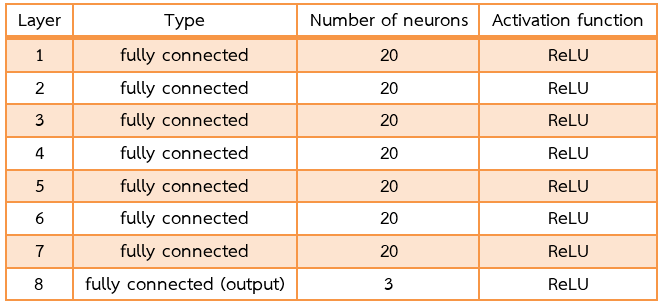
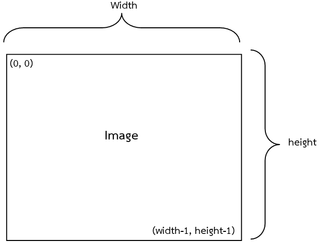
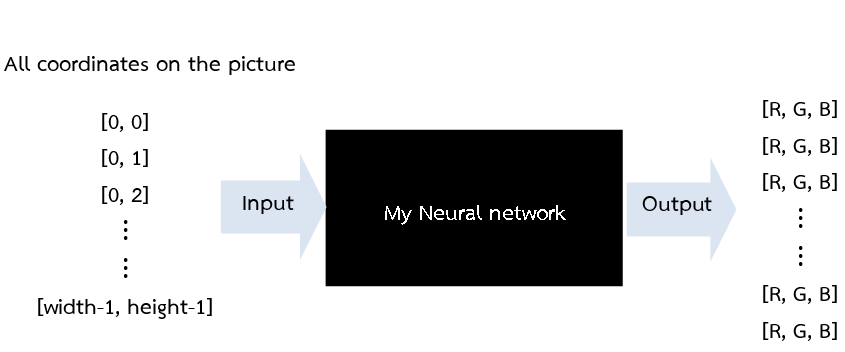

# Example: AI paints a picture

This example will show the neural network (multilayer perceptrons) paints an image

# Code Example

* [paint_tensorflow.py](paint_tensorflow.py)
* [paint_keras.py](paint_keras.py)

# Motivation

My inspiration: http://cs.stanford.edu/people/karpathy/convnetjs/demo/image_regression.html

# Description

## My model structure 

* 7 hidden layers.
* Input layer have 2 ( x, y coordinate or pixels on an image).
* Output layer have 3 (red, breen and blue).

## Concept

Input to the model are x, y coordinates (on an target image).

** In python, size of an image is height x width

If there is one input to the model.

If there are many inputs (many examples) to the model.

For target dataset to train my model, I use real an image as the target dataset when neural network learns from the target image, it can predict 3 outputs are red, green, blue (RGB).

## Result

The picture on the left is original and the right hand side is created by my neural network.

